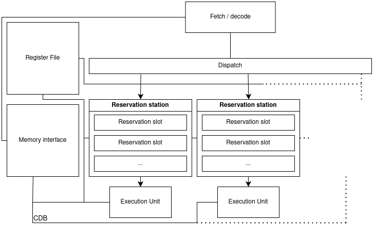

<!-- _class: lead -->

# COMS30046 Advanced Computer Architecture
**Archie Preston**

---
## ISA

| Instruction | arg 1 | arg 2 | arg 3 |          Functionality          | cycles | Instruction | arg 1 | arg 2 | arg 3 |                                                         Functionality                                                          | cycles |
|:-----------:|:-----:|:-----:|:-----:|:-------------------------------:|:------:|:-----------:|:-----:|:-----:|:-----:|:------------------------------------------------------------------------------------------------------------------------------:|:------:|
|    `add`    | $r_1$ | $o_1$ | $o_2$ |   $r_1 \leftarrow o_1 + o_2$    |  $2$   |    `ld`     | $r_1$ | $o_1$ |   _   |                                                   $r_1 \leftarrow mem[o_1]$                                                    |  $10$  |
|    `sub`    | $r_1$ | $o_1$ | $o_2$ |   $r_1 \leftarrow o_1 - o_2$    |  $3$   |    `st`     | $o_1$ | $o_2$ |   _   |                                                   $mem[o_1] \leftarrow o_2$                                                    |  $10$  |
|    `mul`    | $r_1$ | $o_1$ | $o_2$ | $r_1 \leftarrow o_1 \times o_2$ |  $10$  |     `j`     | $o_1$ |   _   |   _   |                                             $\text{pc} \leftarrow \text{pc} + o_1$                                             |  $2$   |
|   `not `    | $r_1$ | $o_1$ |   _   |   $r_1 \leftarrow \lnot o_1$    |  $1$   |   `bilz`    | $r_1$ | $l_1$ |   _   | $\begin{cases} \text{pc} \leftarrow l_1 & \text{if } r_1 < 0 \\ \text{pc} \leftarrow \text{pc} & \text{otherwise} \end{cases}$ |  $5$   |
|    `and`    | $r_1$ | $o_1$ | $o_2$ | $r_1 \leftarrow o_1 \land o_2$  |  $1$   |   `biez`    | $r_1$ | $l_1$ |   _   | $\begin{cases} \text{pc} \leftarrow l_1 & \text{if } r_1 = 0 \\ \text{pc} \leftarrow \text{pc} & \text{otherwise} \end{cases}$ |  $5$   |
|    `or`     | $r_1$ | $o_1$ | $o_2$ |  $r_1 \leftarrow o_1 \lor o_2$  |  $1$   |   `bigz`    | $r_1$ | $l_1$ |   _   | $\begin{cases} \text{pc} \leftarrow l_1 & \text{if } r_1 > 0 \\ \text{pc} \leftarrow \text{pc} & \text{otherwise} \end{cases}$ |  $5$   |
|    `xor`    | $r_1$ | $o_1$ | $o_2$ | $r_1 \leftarrow o_1 \oplus o_2$ |  $1$   |   `halt`    |   _   |   _   |   _   |                                                         Halts program                                                          |  $1$   |
|    `cp`     | $r_1$ | $o_1$ |   _   |      $r_1 \leftarrow o_1$       |  $5$   |   `noop`    |   _   |   _   |   _   |                                                              None                                                              |  $1$   |

---
## Features
 - Superscalar pipeline with n* Execution Units
 - Out of Order execution with Tomasulo's Algorithm

Execution units each have 1 reservation station containing reservation slots.
Each execution can perform all instructions in the ISA

Instructions are issued to the stations with the highets number of free slots, and are fetched from the reservation stations in array order by the execution units (effective random order).

\*number of EUs and slots per Reservation Station configurable via constants 

---
## Diagram

---
## Experiments
### Collatz
Processor calculating the number of collatz iterations for input '27' (111 iterations)

| Cycles  |  1 EU   |  2 EUs  |  3 EUs  |  4 EUs  |
|:-------:|:-------:|:-------:|:-------:|:-------:|
| 1 Slot  | 1181245 | 1180539 | 1180456 | 1180456 |
| 2 Slots | 1222128 | 1261871 | 1180956 | 1180456 |
| 3 Slots | 1262821 | 1262012 | 1180956 | 1180456 |
| 4 Slots | 1303503 | 1262012 | 1180956 | 1180456 |

The more EUs in the processer, the faster the calculations. The increase in cycles with more reservation slots is a bug that will be found and diagnosed for the viva